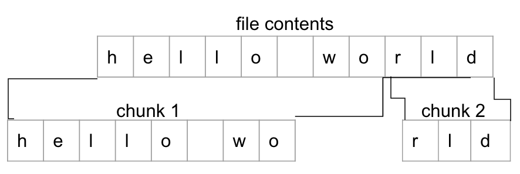
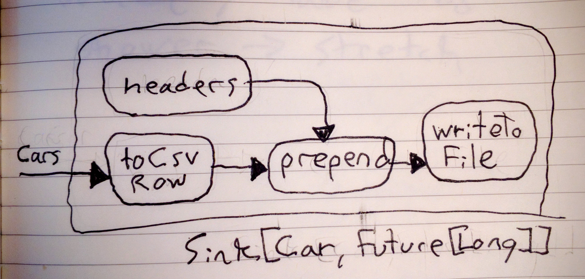

# File IO With Akka Streams

It's not uncommon to work with files too large to fit into memory. When you watch a video file on your laptop, your video player doesn't read the entire file into memory. Instead, it reads the video file as a stream of bytes from which it consumes elements as required. In this blog post, you'll not only learn how to work with files as Sources and Sink that produce and consume streams of bytes, you'll also learn techniques that can be used to transform _any_ stream of binary data.

- Using ByteStrings to manipulate binary data.
- Writing streams of bytes to files.
- Reading streams of bytes from files.
- Transforming streams of bytes into streams of lines and back.
- Reading and writing streams of data to and from CSV files.

## Working with files

Whether you're sending streams of data over the network, reading messages from an event bus like Kafka, sending data between processes on a single machine, or just reading from the file system, you (or more often, the library or framework you're using) will need to work with raw bytes. This post focusses on working with files, but the techniques can be applied to transforming arbitrary streams of bytes.

#### Setup

```bash
git clone https://github.com/pkinsky/file_io_with_akka_streams.git
cd file_io_with_akka_streams
sbt console
```

To follow along with the code examples in this post, clone this project (if you haven't already) and use `sbt console` to start up a REPL with everything already imported and an implicit materializer and execution context already created. Every example in this post is designed to be run from the REPL. You're encouraged to test out different methods and combinations of stream processing graph components.

### Byte strings

`akka.util.ByteString` is a collection type that holds a sequence of bytes, like an `Array[Byte]`. Unlike byte arrays, byte strings are optimized to reduce the number of array copies required to concatenate or slice sequences of bytes. Also unlike arrays, they're fully thread safe. ByteStrings can be created from sequences of numbers, from byte arrays or from `java.nio.ByteBuffers`, but by far the simplest way to create them is from strings. They default to assuming that strings are encoded using the UTF_8 encoding, the default string encoding used by both Java and Scala. ByteString instances also have a convenience method, `utf8String`, that converts a sequence of bytes into its UTF-8 representation.

.ByteString example
```
import akka.util.ByteString
val bytes = ByteString("test") // ByteString(116, 101, 115, 116)
val string = bytes.utf8String // "test"
```

So far, so simple. 116 is the UTF representation of 't', 101 is 'e', and 115 is 's'. You can prove this by checking that `ByteString(116, 101, 115, 116) == ByteString("test")` evaluates to true.

We'll be using byte strings to represent chunks of unstructured binary data in various contexts.

### Reading files as streams of ByteStrings

Akka streams provides tools for reading from and writing to files on the local file system via streams of byte strings. Most hard drives are optimized to work with large file reads, so files are read in chunks (instead of byte by byte or line by line). Each chunk is a single ByteString.

.File Source
```
import java.io.File
val input = new File("data/words1.txt")
val readFile: Source[ByteString, Future[Long]] = FileIO.fromFile(input)
```

`readFile`, the Source created by `FileIO.fromFile`, reads a stream of bytes from the provided file (in this case, data/words1.txt in the streams101 repo). When materialized, it yields a `Future[Long]` which completes with the number of bytes read when the materialized source is done reading from the target file. Note that just defining `readFile` does not create a file handle or have any other side effect. `readFile` can be materialized multiple times and each time it will read byte strings from data/words1.txt.

.Reading from Files
```
val readFileGraph: RunnableGraph[Future[Long]] = readFile.to(Sink.foreach{ bytes => println(bytes.utf8String)})
val f: Future[Long] = readFileGraph.run
f.onComplete{
  case Success(bytesRead) => println(s"read $bytesRead bytes")
  case Failure(t) => println(s"reading file failed with $t")
}
//Test, test...
//Is this thing on?
//This is just a test.
//#$%@!

//read 58 bytes
```

Try modifying the file at data/words1.txt and running `readFileGraph` again. The resulting newly materialized stream processing graph will print the contents of the newly-modified file.

### Writing streams of ByteStrings to files

.File Sink
```
val output = new File("data/out1.txt")
val writeFile: Sink[ByteString, Future[Long]] = FileIO.toFile(output)
```

`writeFile`, the Sink created by `FileIO.toFile`, writes a stream of bytes to the provided file (in this case, data/out1.txt). When materialized, like `FileIO.toFile`, it yields a `Future[Long]` which completes with the number of bytes written when the materialized sink is done writing to the provided file. As with `readFile`, defining `writeFile` has no side effects. Merely defining the Sink does not modify the file system in any way.

.Copying Files
```
val copyGraph: RunnableGraph[(Future[Long], Future[Long])] = readFile.toMat(writeFile)(Keep.both)
val (bytesReadF, bytesWrittenF): (Future[Long], Future[Long]) = copyGraph.run
for {
  bytesRead <- bytesReadF
  bytesWritten <- bytesWrittenF
} println(s"read $bytesRead bytes, wrote $bytesWritten bytes")

//read 58 bytes, wrote 58 bytes
```

By combining `readFile` and `writeFile` we can create a graph that copies the contents of one file to another. When combining the two, `Keep.both` is used to hang onto both materialization values ( `Keep.both` is just a function from `(A, B)` to `(A, B)`, just like `Keep.left` is a function from `(A, B)` to `A` and `Keep.right` is a function from `(A, B)` to `B`).

After running `copyGraph`, data/out1.txt should now exist and have the same contents as data/words1.txt. Try deleting data/out1.txt and running `copyGraph` again: a new data/out1.txt is created each time `copyGraph` is materialized.

### Transforming streams of ByteStrings

We can also apply transformations to streams of byte strings. Let's start with something simple, an upgraded version of `copyGraph` that also converts every character in the original file to upper case.

.toUpperCase
```
val toUpperCopyGraph: RunnableGraph[Future[(Long, Long)]] =
  readFile.map{ (b: ByteString) =>
    val asString = b.utf8String
    val upperCase = asString.toUpperCase
    ByteString(upperCase)
  }.toMat(writeFile)( //we can also provide our own functions to combine materialization values
    (bytesRead, bytesWritten) => bytesRead.zip(bytesWritten)
  )

val f: Future[(Long, Long)] = toUpperCopyGraph.run
val (bytesRead, bytesWritten): (Long, Long) = Await.result(f, 1 second)
//bytesRead: Long = 58
//bytesWritten: Long = 58
```

`toUpperCopyGraph` graph reads data from the file at data/words1.txt as a stream of byte string chunks, converts each chunk into a utf8 string, converts that string to upper case, converts the upper case string back to a string of bytes, and writes those bytes to the file at data/out1.txt. The number of bytes written and read are the same, because all we're doing is changing individual characters from lower to upper case. The lower-case and upper-case representation of each character used here takes up the same number of bytes.

### Multibyte characters and other complications

`FileIO.fromFile` also takes an optional chunk size parameter which defaults to 8192. When the resulting source is materialized, it reads the target file's contents as a stream of byte strings with length equal to the chunk size parameter (except for the last chunk, which might be smaller). In these examples, we've only worked with files much smaller than 8192 bytes (data/words1.txt is only 58 bytes long). In the real world, we might instead work with very large, multi-megabyte files. The boundary between two chunks of bytes might split a line, a word, or even a character into two pieces.




Instead of working with files too large to be read in a single chunk, we can set the chunkSize parameter to unfeasibly low numbers to see what happens (working in the REPL makes this type of quick experiment easy. Instead of having to run our application every time we want to test something out, we can quickly run experiments and try different approaches).

.smaller chunks
```
val f1 = FileIO.fromFile(input, chunkSize = 16).map(_.utf8String).toMat(Sink.head)(Keep.right).run
f1.onComplete(println)
//Success(Test, test...
//Is)

val f2 = FileIO.fromFile(input, chunkSize = 8).map(_.utf8String).toMat(Sink.head)(Keep.right).run
f2.onComplete(println)
//Success(Test, te)
```

If we read from the same input file using smaller chunk sizes like 16 or 8, we can see that sometimes chunk boundaries split lines or words. If the chunk size is set to 16, as in the first example, the chunk boundary falls in the middle of the second line of data/words1.txt. In the second example, with chunk size 8, the chunk boundary splits a word, 'test', into 'te' and 'st'. The transformation applied by `upperCaseGraph` works on a per-character basis, so neither of these considerations effect it, but they are important if you want to apply nontrivial transformations that require working with files as more than collections of characters.

Even worse, utf8 is a variable length encoding, which means that some characters, like 'Ǯ', can take up multiple bytes when converted to `ByteString`. That means that it's possible to split a character across two chunks, resulting in completely invalid characters.

.Multibyte characters
```
val multibyte = ByteString("ǭǮ") //ByteString(-57, -83, -57, -82)
val (left, right) = multibyte.splitAt(3) //(ByteString(-57, -83, -57), ByteString(-82))
left.utf8String // "ǭ�"
right.utf8String // "�"
```

Most English characters are single-byte characters, so this problem usually doesn't occur during development. But what if your app becomes popular internationally, and you start to pick up Chinese users? Your users might notice that every once and a while, instead of a common phrase such as 我的气垫船装满了鳝鱼 (my hovercraft is full of eels), they see 我的气垫��装满了鳝鱼, in which the bytes representing one character are improperly split into two chunks that are both interpreted as invalid characters, turning 船 into ��.

### Splitting streams of bytes into streams of lines

If you want to write really robust applications that deal with unstructured binary data, you need to control the boundaries separating strings of bytes in your streams. The simplest way to do this is to split up each chunk based on some delimiter character or sequence of characters. To read a file as a stream of lines, we would read a file and split based on new line characters. New lines are represented by "\n" on Unix systems and "\r\n" on Windows.

#### ToLines

```
val delimiter = ByteString("\n") // "\r\n" if on windows
val toLines: Flow[ByteString, String, Unit] =
  Framing.delimiter(
    delimiter = delimiter,
    maximumFrameLength = 1024,
    allowTruncation = true
  ).map{ bytes =>
    if (bytes.endsWith(delimiter)) bytes.dropRight(delimiter.length)
    else bytes
  }.map( bytes => bytes.utf8String )
```

Fortunately, Akka Streams provides helpers for working with streams of unstructured data. `Framing.delimiter` takes a byte string delimiter (in this case `ByteString("\n")`), a maximum line length, and a third parameter, allowTruncation, which controls whether or not the last line is required to end with the delimiter sequence (in this case, setting allowTruncation to false would cause the flow to fail if used with a file that not ending with a newline character).

#### Testing ToLines

```
val readLinesGraph: RunnableGraph[Future[Seq[String]]] = FileIO.fromFile(input, chunkSize = 16).via(toLines).toMat(Sink.seq)(Keep.right)
val f: Future[Seq[String]] = readLinesGraph.run
f.onComplete(println)
//Success(Vector(Test, test..., Is this thing on?, This is just a test., #$%@!))
```

Here we build a graph that uses `Sink.seq`, a Sink that adds each element consumed to a sequence. Each time a Sink created by `Sink.seq[T]` is materialized, it returns a `Future[Seq[T]]` that completes with the sequence of elements consumed when the upstream completes or fails if the upstream fails. Note that despite setting chunk size to 16 which, as we saw earlier, results in chunk boundaries that split the second line of data/words1.txt into two pieces, the resulting stream is still properly split into lines.


## Working with CSV files

Now that we have a way to transform streams of unstructured binary data into streams of delimiter-separated chunks (streams of lines, in this case), let's apply the techniques we've learned to dealing with structured data. In this section, you'll learn how to work with CSV files.

CSV, or comma separated value, files use a simple storage format with near universal support. Business software like Excel, databases, scientific tools and most if not all programming languages support the CSV format. A CSV file holding records describing a list of cars might look something like this:

#### Sample CSV

```csv
model, year
DeLorean, 1982
Ferrari, 1947
```

CSV files are made up of rows, each taking up one line. Each row is made up of columns, separated by commas. Each row in a CSV file has the same number of columns. The first row is an optional header that contains the name of each column (it will be present in all CSV files used in this post). Every row following the first is a data record.

#### Simple CSV encoding

```
case class Car(model: String, year: Int)
def toCsvRow(c: Car): String = s"${c.model}, ${c.year}"

def carsToCsvStrict(cars: List[Car]): String = {
  val header = "model, year"
  val rows = cars.map(toCsvRow)
  val lines = Seq(header) ++ rows
  lines.mkString("\n")
}

carsToCsvStrict(List(Car("DeLorean", 1982), Car("Ferrari", 1947)))
//model, year
//DeLorean, 1982
//Ferrari, 1947
```

We can easily convert small, in memory, sequences of elements to CSV rows. The first row, the header, contains the field names: model and year. Every subsequent row contains values for each of those fields in the same order.

### Writing CSV files

We can also write streams of elements to CSV files. We'll need to convert a stream of Cars into a stream of CSV file lines, then write that stream of lines to a file Sink. Let's tackle the second part of that problem first.

.Writing a stream of lines to a file
```
def writeLinesToFile(f: File): Sink[String, Future[Long]] = {
    Flow[String]
      .intersperse("\n")
      .map( s => ByteString(s))
      .toMat(FileIO.toFile(f))(Keep.right)
  }
```

This Sink handles inserting newlines using `intersperse("\n")`, which inserts some value (in this case a single-character newline string) in between each element of a stream. Next, we map over the stream of lines and newlines to convert it into a stream of `ByteString` and then write those byte strings to the provided file (using `toMat` and `Keep.right` to hang onto the `Future[Long]` that is the materialization value of the Sink created by `FileIO.toFile`).

.CSV streaming write
```scala
def writeCarsToFile(f: File): Sink[Car, Future[Long]] = {
  val headers: Source[String, Unit] = Source.single("model, year")

  Flow[Car].map(toCsvRow)
    .prepend(headers)
    .toMat(writeLinesToFile(f))(Keep.right)
}
```

Here we take a Flow of Cars and map over each to convert it to a CSV row. Then, we prepend a Source containing the header row to the stream of lines to be written to the CSV file. Prepend reads every element from the provided source (just one element, in this case) before reading any from upstream. Note that if prepend is used with an infinite Source, the resulting Flow will only ever consume elements from that Source and not any other upstream Sources.



As you can see, the Sink-shaped stream processing graph defined by `writeCarsToFile` uses `prepend` to combine the output of the `headers` Source with the output of the previous stage, a Flow that applies the `toCsvRow` function to each element consumed by the Sink defined by `writeCarsToFile`.

Let's test `writeCarsToFile` by writing a few sample values to a file, cars.csv.

#### CSV streaming write test pt 1

```scala
val cars = List(Car("DeLorean", 1982), Car("Ferrari", 1947))
val outFile = new File("cars.csv")

val graph: RunnableGraph[Future[Long]] = Source(cars).toMat(writeCarsToFile(outFile))(Keep.right)

graph.run().onComplete{
  case Success(b) => println(s"wrote $b bytes to $outFile")
  case Failure(t) => println(s"writing bytes to $outFile failed with $t")
}

//wrote 40 bytes to cars.csv
```

Let's look at cars.csv to confirm that it contains the expected rows.

#### CSV streaming write test pt 2

```scala
> cat cars.csv
model, year
DeLorean, 1982
Ferrari, 1947⏎
```

It does. By writing to CSV files, you can output data in a format that is widely-understood (by both humans and machines) and portable.

### Parsing CSV files

Parsing CSV-encoded data is quite simple. For this post, we'll be making a few simplifying assumptions. First, commas and newlines are _reserved characters_. They will only be used to separate rows and lines. Second, all CSV files have a header row.

.CSV streaming read prelude
```scala
def csvRowToCar(s: String): Option[Car] = Try{
  val parts = s.split(",")
  Car(parts(0).trim, parts(1).trim.toInt)
}.toOption

val csvRow = toCsvRow(Car("DeLorean", 1982))
//DeLorean, 1982
csvRowToCar(csvRow)
//Some(Car("DeLorean", 1982))

csvRowToCar("some nonsense, definitely not a valid csv row")
//None
```

Using `csvRowToCar` we can easily parse CSV rows, resulting in either `Some(x: Car)` (if parsing succeeds) or `None` (if parsing fails).

Now all we need to do is apply this function to a stream of lines read from a CSV file. Let's start by creating a Flow that consumes strings, parses them, and produces Cars, then use that to build a Source that reads CSV-encoded Car records from some file.

.parseCarsCSV
```scala
val parseCarsCSV: Flow[String, Car, Unit] =
  Flow[String].map(csvRowToCar).collect{ case Some(car) => car }
```

`parseCarsCSV` uses `map` to apply the `csvRowToCar` function to each string consumed by the Flow, resulting in an `Option[Car]` which is then either unwrapped (resulting in a plain old `Car`) or filtered out using `collect` and a partial function that pattern-matches `Some`.

.CSV streaming read
```scala
def readCarsFromFile(f: File): Source[Car, Future[Long]] =
  FileIO.fromFile(f).via(toLines).drop(1).via(parseCarsCSV)
```

`readCarsFromFile` reads byte strings from the provided file, converts them to lines using `toLines` (defined earlier in this post), drops the first header row using `drop(1)` and parses them using `parseCarsCSV`. Let's test it out by reading the CSV file, cars.csv, that we just wrote some test values to.

.CSV streaming read test
```scala
val inFile = new File("cars.csv")
val graph: RunnableGraph[Future[Seq[Car]]] = readCarsFromFile(inFile).toMat(Sink.seq)(Keep.right)
val cars = Await.result(graph.run, 5 seconds)
//Vector(Car(DeLorean,1982), Car(Ferrari,1947))
```

As expected, the resulting `Car` records are the same as those written to disk using `writeCarsToFile` earlier in this section.

### Reading arbitrary CSV files

This is all good for when we want to incorporate CSV files into our program, but what if we just want some tools to simplify working with arbitrary CSV files as streams? Let's create our own! We'll use `Map[String, String]` to represent each row read from a CSV file and use the first row of the file to figure out the field names that will be used as keys in these maps.

.Arbitrary CSV widget read
```scala
type CsvRow = Map[String, String] <1>

def readArbitraryCSV(f: File): Source[CsvRow, Future[Long]] = {

  def parseCSV(fieldNames: Seq[String]): Flow[String, CsvRow, Unit] = { <2>
    Flow[String].map{ row =>
      val parts = row.split(",").map(_.trim)
      fieldNames.zip(parts).toMap
    }
  }

  val parseArbitrary: Flow[String, CsvRow, Unit] = { <3>
    Flow[String]
      .prefixAndTail(1) <4>
      .flatMapConcat{ case (prefix: Seq[String], tail: Source[String, Unit]) => <5>
        prefix.headOption.fold(Source.empty[CsvRow]){ header => <6>
          val fieldNames = header.split(",").map(_.trim) <7>
          tail.via(parseCSV(fieldNames))
        }
      }
  }

  FileIO.fromFile(f).via(toLines).via(parseArbitrary) <8>
}
```

<1> For convenience and readability, we'll use the type alias `CsvRow` instead of `Map[String, String]`.
<2> Given some sequence of field names, create a Flow that consumes lines and produces `CsvRow` instances.
<3> Now for the main event: a Flow that consumes strings and produces `CsvRow` instances
<4> This is where things get complicated. Using `prefixAndTail(1)`, we convert a Flow of strings into a Flow that consumes strings and produces a single element of type `(Seq[String], Source[String, Unit])`. The sequence contains the first element consumed by the Flow (if any were consumed) and the Source produces all other elements consumed by the Flow.
<5> Now that we have a Flow of Sources (technically, a `Flow[String, (Seq[String], Source[String, Unit])]`), we can flatten it using `flatMapConcat`.
<6> We start by looking at the first element of the `prefix` sequence. If there's no element, that means the upstream completed before sending any strings downsteam, so we return an empty Source of `CsvRow`.
<7> If we do have a header row, we split it into field names, use those field names to create a CSV parser Flow using `parseCSV`, append that Flow to the `tail` Source using `via`, and return the resulting Source of `CsvRow` instances which is then flattened by `flatMapConcat`, resulting in a `Flow[String, CsvRow]`
<8> Finally, we create a Source to read byte strings from the provided file using `FileIO.fromFile` and use the `toLines` and `parseArbitrary` Flows to convert the resulting stream of byte strings to lines and then to `CsvRow` instances.


Let's test `readArbitraryCSV` on cars.csv, to confirm that it behaves as expected given known input.


.Testing with cars.csv
```scala
val inFile = new File("cars.csv")
val graph: RunnableGraph[Future[Seq[CsvRow]]] = readArbitraryCSV(inFile).toMat(Sink.seq)(Keep.right)
val carCsvRows = Await.result(graph.run, 5 seconds)
//Vector(
//  Map(model -> DeLorean, year -> 1982),
//  Map(model -> Ferrari, year -> 1947)
//)
```

As expected, we get a stream of `CsvRow` instances, each with keys taken from the header row mapping to values.

Let's test it with some test user data stored in data/test_users.csv.

.Testing with random CSV file
```scala
val inFile = new File("data/test_users.csv")
val graph: RunnableGraph[Future[Seq[CsvRow]]] = readArbitraryCSV(inFile).toMat(Sink.seq)(Keep.right)
val userCsvRows = Await.result(graph.run, 5 seconds)
//Vector(
//Map(first_name -> Larry, email -> lmorrison1@nasa.gov, id -> 2, last_name -> Morrison, ip_address -> 95.158.75.180, gender -> Male),
//Map(first_name -> Shawn, email -> sanderson2@canalblog.com, id -> 3, last_name -> Anderson, ip_address -> 155.62.50.245, gender -> ),
//Map(first_name -> Sara, email -> sgomez3@csmonitor.com, id -> 4, last_name -> Gomez, ip_address -> 143.21.115.20, gender -> Female),
//...
//)
```

We can use `readArbitraryCSV` to read arbitrary CSV files, allowing us to quickly construct single-use stream processing graphs to process CSV files too large to fit into memory. For example, let's say we want to count the number of users of each gender in a multi-gigabyte database dump of our user database. Instead of creating a case class to represent users, writing and debugging a `csvRowToUser` function and using it to create a custom Source, we can just reuse `readArbitraryCSV`.

.Counting users by gender
```
val inFile = new File("data/test_users.csv")
val defaultGender = "n/a" //AI's, hive minds, etc may wish to set the gender field to n/a

val countByGender: Sink[CsvRow, Future[Map[String, Int]]] =
  Sink.fold(Map.empty[String, Int]){ (map, user) =>
    //if gender field is blank, fall back to default gender
    val gender = user.get("gender").map(_.trim).filter(_.nonEmpty).getOrElse(defaultGender)

    map.updated(gender, map.getOrElse(gender, 0) + 1)
  }

val graph: RunnableGraph[Future[Map[String, Int]]] = readArbitraryCSV(inFile).toMat(countByGender)(Keep.right)
graph.run.onComplete(println)

//Success(Map(Male -> 16, Female -> 8, n/a -> 5))
```

First we create `countByGender`, a Sink that consumes a stream of `CsvRow` instances, folding over them to build a count of users per gender (and falling back to n\a if the gender field for a `CsvRow` is an empty string). Then, we append this Sink to a Source of `CsvRow` created using `readArbitraryCSV` to create a `RunnableGraph[Future[Map[String, Int]]]`. When this graph is run, we discover that the CSV file contains 16 male users, 8 female users, and 5 that have not provided any gender information.

In this case we're working with a small file, but this same technique can easily be applied to much larger files, right from the REPL.

## Recap

//todo: structure as standalone github project with sample code in same
//todo: consider dropping arbitrary CSV reader
In this post we learned:

//todo: expand this w/ more on byte strings
. How to transform streams of byte string chunks read from files into streams of lines
. How to use Akka Streams to encode and decode CSV files
. How to use Akka Streams to quickly explore large CSV files.
